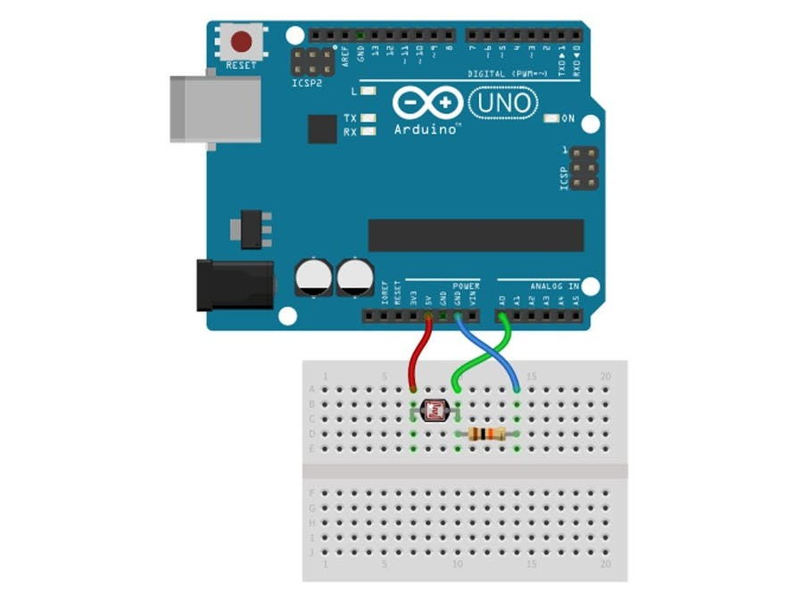

# Morse decoder

The project's idea is very simple, the Arduino program has the responsibility to upload the sensor's data to the USB serial port. From there I used plain old C++ to  read the stored signal (in Unix, everything is a file) and plotting them in the application. In the first run of the project, this was my only target, but since the signal/noise ratio was so good, I saw it suitable for transporting information and that is when Morse code comes into the play. I was quite surprised by how well the setup worked out, so here is the result of me demonstrating to decoding a message generated by an Android app.
 

### Setup

The light dependent transistor (https://en.wikipedia.org/wiki/Photoresistor) is a passive component that decreases resistance with respect to receiving luminosity (light) on the component's sensitive surface. Arduino gave me a really nice tool to start with this component, the bread board setup is really easy, too.

With some standard component and a bit tutorial of https://create.arduino.cc/projecthub/sumanbargavr/working-with-light-dependent-resistor-ldr-1ded4f and we are ready to go. 

### References

- [Huge thanks to https://github.com/gbmhunter for the amazing serial port reader. My implementation could interact with the port but yours is way superior](https://github.com/gbmhunter/CppLinuxSerial)
